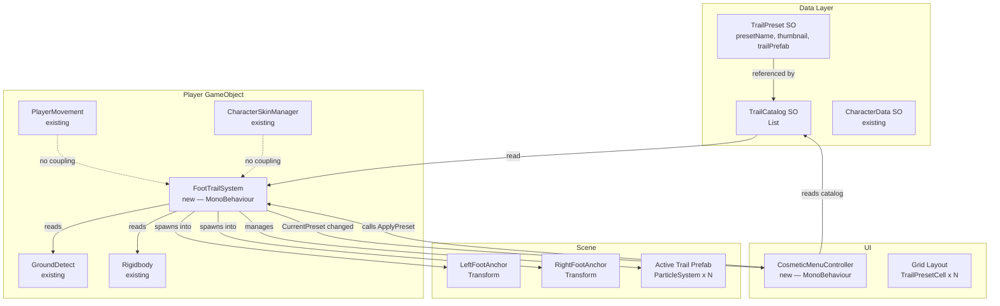
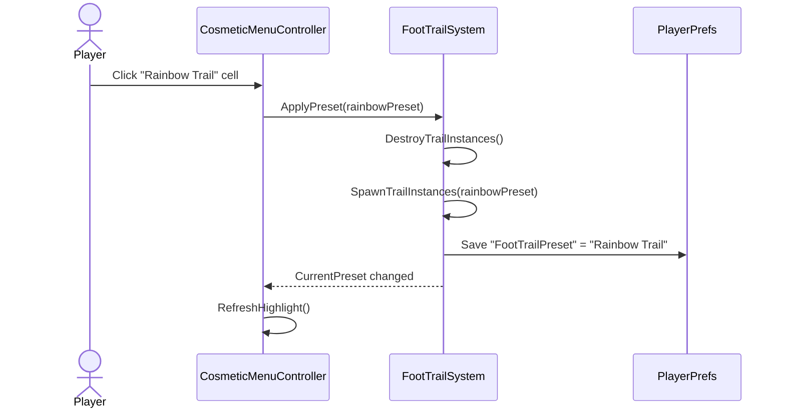
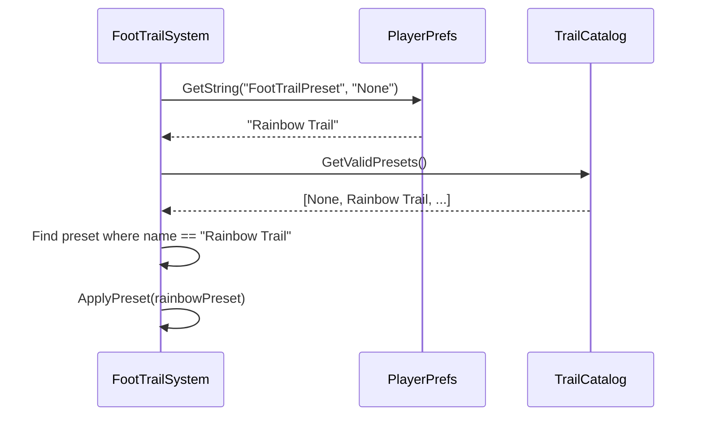

# Design Document — Foot Trail Effects

## Overview

Foot Trail Effects là một hệ thống cosmetic plug-in cho phép người chơi chọn hiệu ứng vệt chân (particle trail) hiển thị khi nhân vật di chuyển. Hệ thống được thiết kế như một module độc lập, không can thiệp vào CharacterSkinManager hay PlayerMovement hiện có.

**Mục tiêu thiết kế:**
- Dễ mở rộng: artist/designer thêm preset mới bằng ScriptableObject, không sửa code.
- Hiệu suất tốt: không Instantiate/Destroy mỗi frame; early-exit khi không có preset.
- Tích hợp nhẹ nhàng: chỉ đọc `GroundDetect.isGrounded` và `Rigidbody.linearVelocity` từ Player.
- Tương thích URP: tất cả material dùng URP Particle Shader.

**Hệ thống cũ (RunDustVFX) vs hệ thống mới:**

| | RunDustVFX (cũ) | FootTrailSystem (mới) |
|---|---|---|
| Số preset | 1 (hardcoded) | 10+ (ScriptableObject) |
| Thay đổi preset | Không thể | Runtime qua `ApplyPreset()` |
| Lưu lựa chọn | Không | PlayerPrefs |
| Quản lý vòng đời | Luôn chạy | Chỉ chạy khi có preset |
| UI | Không có | Cosmetic_Menu grid |


## Architecture



### Luồng dữ liệu chính

1. **Startup**: `FootTrailSystem.Start()` → đọc PlayerPrefs → tìm preset trong TrailCatalog → gọi `ApplyPreset()`.
2. **Player chọn preset**: `CosmeticMenuController` nhận click → gọi `FootTrailSystem.ApplyPreset(preset)` → lưu PlayerPrefs → UI cập nhật highlight.
3. **Runtime Update**: `FootTrailSystem.Update()` → đọc `isGrounded` + `horizontalSpeed` → bật/tắt emission trên các ParticleSystem của prefab đang active.
4. **Apply Preset**: Destroy prefab cũ → Instantiate prefab mới vào LeftFootAnchor & RightFootAnchor → cache ParticleSystem references.


## Components and Interfaces

### 1. TrailPreset (ScriptableObject)

**Path:** `Assets/Scripts/VFX/FootTrail/TrailPreset.cs`

```csharp
[CreateAssetMenu(fileName = "TrailPreset", menuName = "Noah's Ark/Trail Preset")]
public class TrailPreset : ScriptableObject
{
    [SerializeField] private string presetName;
    [SerializeField] private Sprite thumbnail;
    [SerializeField] private GameObject trailPrefab;

    public string PresetName  => presetName;
    public Sprite  Thumbnail  => thumbnail;
    public GameObject TrailPrefab => trailPrefab;
}
```

**Ghi chú:** `trailPrefab` được phép null — đây là cách định nghĩa `None_Preset` mà không cần subclass riêng. Ngoài ra, một `TrailPreset` asset chuyên dụng tên "None" có `trailPrefab = null` sẽ đóng vai trò `nonePreset`.

---

### 2. TrailCatalog (ScriptableObject)

**Path:** `Assets/Scripts/VFX/FootTrail/TrailCatalog.cs`

```csharp
[CreateAssetMenu(fileName = "TrailCatalog", menuName = "Noah's Ark/Trail Catalog")]
public class TrailCatalog : ScriptableObject
{
    [SerializeField] private TrailPreset nonePreset;
    [SerializeField] private List<TrailPreset> presets;

    public TrailPreset NonePreset => nonePreset;

    /// Trả về danh sách đã lọc null, bắt đầu bằng nonePreset.
    public IReadOnlyList<TrailPreset> GetValidPresets()
    {
        var result = new List<TrailPreset> { nonePreset };
        foreach (var p in presets)
        {
            if (p == null) { Debug.LogWarning("[TrailCatalog] Null entry skipped."); continue; }
            result.Add(p);
        }
        return result;
    }
}
```


### 3. FootTrailSystem (MonoBehaviour)

**Path:** `Assets/Scripts/VFX/FootTrail/FootTrailSystem.cs`

```csharp
public class FootTrailSystem : MonoBehaviour
{
    // ── Inspector ───────────────────────────────────────────────────────────
    [Header("Catalog")]
    [SerializeField] private TrailCatalog catalog;

    [Header("Foot Anchors")]
    [SerializeField] private Transform leftFootAnchor;
    [SerializeField] private Transform rightFootAnchor;

    [Header("Activation Thresholds")]
    [SerializeField] private float minSpeedThreshold  = 0.5f;   // m/s walk threshold
    [SerializeField] private float runSpeedThreshold  = 4.0f;   // m/s run threshold
    [SerializeField] private float walkEmissionRate   = 1.0f;   // base rateOverDistanceMultiplier
    [SerializeField] private float runEmissionRate    = 2.0f;   // 2x for run

    // ── Runtime ─────────────────────────────────────────────────────────────
    private TrailPreset _currentPreset;
    private GameObject  _leftInstance;
    private GameObject  _rightInstance;
    private ParticleSystem.EmissionModule[] _emissionsLeft;
    private ParticleSystem.EmissionModule[] _emissionsRight;

    // ── Dependencies (auto-resolved via GetComponentInParent) ────────────────
    private Rigidbody    _rb;
    private GroundDetect _groundDetect;

    // ── Public API ──────────────────────────────────────────────────────────
    public TrailPreset CurrentPreset => _currentPreset;

    public void ApplyPreset(TrailPreset preset);   // Req 1.1, 1.2, 1.3, 1.4
    public void SaveAndApplyPreset(TrailPreset preset); // calls ApplyPreset + PlayerPrefs save

    // ── Private helpers ──────────────────────────────────────────────────────
    private void SpawnTrailInstances(TrailPreset preset);
    private void DestroyTrailInstances();
    private void CacheEmissions(GameObject instance, out ParticleSystem.EmissionModule[] modules);
    private void SetEmission(bool enabled, float rate);
    private void LoadSavedPreset();                // Req 5.2, 5.3
}
```

**Lifecycle:**

```
Awake  → resolve _rb, _groundDetect via GetComponentInParent
Start  → LoadSavedPreset() [reads PlayerPrefs, calls ApplyPreset]
Update → if (_currentPreset == nonePreset || _leftInstance == null) return;
         horizontalSpeed = Flatten(_rb.linearVelocity).magnitude
         shouldEmit = isGrounded && horizontalSpeed >= minSpeedThreshold
         rate = horizontalSpeed >= runSpeedThreshold ? runEmissionRate : walkEmissionRate
         SetEmission(shouldEmit, rate)
```


### 4. CosmeticMenuController (MonoBehaviour)

**Path:** `Assets/UI/Scripts/Views/CosmeticMenuController.cs`

```csharp
public class CosmeticMenuController : MonoBehaviour
{
    [Header("Data")]
    [SerializeField] private TrailCatalog catalog;
    [SerializeField] private FootTrailSystem footTrailSystem;

    [Header("UI")]
    [SerializeField] private Transform gridContainer;
    [SerializeField] private TrailPresetCell cellPrefab;

    // ── Runtime ─────────────────────────────────────────────────────────────
    private List<TrailPresetCell> _cells = new();

    // ── Unity lifecycle ──────────────────────────────────────────────────────
    private void Start();         // validates catalog, builds grid
    private void OnEnable();      // refreshes highlight to match CurrentPreset

    // ── Public API ──────────────────────────────────────────────────────────
    public void OnCellClicked(TrailPreset preset);  // called by TrailPresetCell
    public void RefreshHighlight();                  // syncs highlight with CurrentPreset

    // ── Private ──────────────────────────────────────────────────────────────
    private void BuildGrid();
}
```

### 5. TrailPresetCell (MonoBehaviour — UI cell)

**Path:** `Assets/UI/Scripts/Views/TrailPresetCell.cs`

```csharp
public class TrailPresetCell : MonoBehaviour
{
    [SerializeField] private Image       thumbnailImage;
    [SerializeField] private TMP_Text    nameLabel;
    [SerializeField] private GameObject  highlightBorder;
    [SerializeField] private Button      button;

    public TrailPreset Preset { get; private set; }

    public void Initialize(TrailPreset preset, CosmeticMenuController controller);
    public void SetHighlight(bool active);
}
```


## Data Models

### TrailPreset Asset Fields

| Field | Type | Default | Ghi chú |
|---|---|---|---|
| `presetName` | `string` | `""` | Hiển thị trong UI; dùng để match PlayerPrefs |
| `thumbnail` | `Sprite` | `null` | 128×128 px, nền trong suốt |
| `trailPrefab` | `GameObject` | `null` | null = None (không có hiệu ứng) |

### TrailCatalog Asset Fields

| Field | Type | Default | Ghi chú |
|---|---|---|---|
| `nonePreset` | `TrailPreset` | required | Preset đặc biệt "None", `trailPrefab = null` |
| `presets` | `List<TrailPreset>` | `[]` | Các preset thực; null entries bị bỏ qua |

### FootTrailSystem Serialized Fields

| Field | Type | Default | Ghi chú |
|---|---|---|---|
| `catalog` | `TrailCatalog` | required | |
| `leftFootAnchor` | `Transform` | required | Gắn vào bone bàn chân trái |
| `rightFootAnchor` | `Transform` | required | Gắn vào bone bàn chân phải |
| `minSpeedThreshold` | `float` | `0.5` | m/s — dưới mức này tắt emission |
| `runSpeedThreshold` | `float` | `4.0` | m/s — trên mức này nhân đôi emission rate |
| `walkEmissionRate` | `float` | `1.0` | `rateOverDistanceMultiplier` khi đi bộ |
| `runEmissionRate` | `float` | `2.0` | `rateOverDistanceMultiplier` khi chạy |

### PlayerPrefs Schema

| Key | Value | Ghi chú |
|---|---|---|
| `"FootTrailPreset"` | `TrailPreset.presetName` | `"None"` nếu None_Preset được chọn hoặc không có preset |


## Particle System Configurations

Mỗi preset có một Prefab chứa **2 child GameObject** (hoặc cấu trúc tương đương) — một cho chân trái và một cho chân phải (hoặc dùng chung 1 prefab, spawn 2 instance). Dưới đây là cấu hình ParticleSystem khuyến nghị. Tất cả Material phải dùng **Universal Render Pipeline/Particles/Unlit** (hoặc `Particles/Additive` URP variant).

### Quy tắc chung (áp dụng cho tất cả preset)

| Setting | Giá trị |
|---|---|
| Max Particles | ≤ 200 |
| Simulation Space | World |
| Renderer Mode | Billboard |
| Render Alignment | View |
| Material Shader | URP Particles/Unlit hoặc Particles/Additive |
| `Emission > Rate over Distance` | Điều chỉnh qua `rateOverDistanceMultiplier` (code) |

---

### 1. Rainbow Trail 🌈
Vệt cầu vồng 7 màu kéo dài theo bước chân.

| Setting | Giá trị |
|---|---|
| Start Lifetime | 0.4 – 0.7 s |
| Start Speed | 0.2 – 0.5 |
| Start Size | 0.05 – 0.15 |
| Color over Lifetime | Gradient 7 màu cầu vồng (R→O→Y→G→B→I→V) |
| Emission Rate over Distance | 8 |
| Shape | Sphere, Radius 0.05 |
| Renderer | Stretched Billboard, Length Scale 3 |

### 2. Star Dust ⭐
Ngôi sao nhỏ lấp lánh rơi xuống.

| Setting | Giá trị |
|---|---|
| Start Lifetime | 0.5 – 1.0 s |
| Start Speed | 0.3 – 1.0, direction Y = −1 |
| Start Size | 0.04 – 0.1 |
| Start Color | Vàng sáng (#FFE066), alpha fade out |
| Texture Sheet | 4×4 star sprite sheet |
| Emission Rate over Distance | 6 |
| Gravity Modifier | 0.3 |
| Shape | Circle, Radius 0.05 |

### 3. Smoke Puff 💨
Khói trắng bồng bềnh bay lên.

| Setting | Giá trị |
|---|---|
| Start Lifetime | 0.6 – 1.2 s |
| Start Speed | 0.5 – 1.5, direction Y = 1 |
| Start Size | 0.1 – 0.25 |
| Color over Lifetime | Trắng → xám nhạt → trong suốt |
| Size over Lifetime | Tăng từ 0.1 → 0.3 |
| Emission Rate over Distance | 4 |
| Shape | Circle, Radius 0.06 |
| Renderer Mode | Billboard |

### 4. Sparkle Dust ✨
Bụi ánh kim nhấp nháy phát sáng.

| Setting | Giá trị |
|---|---|
| Start Lifetime | 0.3 – 0.6 s |
| Start Speed | 0.5 – 2.0 |
| Start Size | 0.03 – 0.08 |
| Start Color | Trắng/vàng với HDR bloom |
| Color over Lifetime | Nhấp nháy (Oscillate alpha) |
| Emission Rate over Distance | 10 |
| Shape | Sphere, Radius 0.04 |
| Material | Additive blend |


### 5. Bubble Pop 🫧
Bong bóng xà phòng nổi lên và vỡ.

| Setting | Giá trị |
|---|---|
| Start Lifetime | 0.8 – 1.5 s |
| Start Speed | 0.5 – 1.2, direction Y = 1 |
| Start Size | 0.06 – 0.14 |
| Start Color | Xanh nhạt, alpha = 0.6 |
| Color over Lifetime | Fade out cuối đời |
| Emission Rate over Distance | 5 |
| Shape | Circle, Radius 0.05 |
| Texture | Bubble sprite (viền mỏng, trong suốt trung tâm) |
| Sub Emitter | Burst 4 particles khi chết (bong bóng vỡ) |

### 6. Flower Petals 🌸
Cánh hoa nhỏ rơi theo từng bước chân.

| Setting | Giá trị |
|---|---|
| Start Lifetime | 1.0 – 2.0 s |
| Start Speed | 0.2 – 0.8 |
| Start Size | 0.05 – 0.12 |
| Start Color | Hồng/trắng/tím, random |
| Start Rotation | 0 – 360° |
| Angular Velocity | −90 – 90 °/s |
| Gravity Modifier | 0.2 |
| Emission Rate over Distance | 4 |
| Shape | Sphere, Radius 0.05 |
| Texture Sheet | 3 loại cánh hoa khác nhau |

### 7. Electric Sparks ⚡
Tia điện nhỏ bắn ra xung quanh.

| Setting | Giá trị |
|---|---|
| Start Lifetime | 0.15 – 0.35 s |
| Start Speed | 1.5 – 4.0 |
| Start Size | 0.02 – 0.06 |
| Start Color | Trắng/vàng điện, HDR intensity 2 |
| Emission Rate over Distance | 12 |
| Shape | Sphere, Radius 0.03 |
| Material | Additive blend |
| Renderer | Stretched Billboard, Length Scale 5 |
| Trail Module | Enable, lifetime ratio 0.3, width 0.02 |

### 8. Snow Flurry ❄️
Bông tuyết nhỏ bay ra và tan dần.

| Setting | Giá trị |
|---|---|
| Start Lifetime | 0.8 – 1.5 s |
| Start Speed | 0.3 – 1.0 |
| Start Size | 0.04 – 0.1 |
| Start Color | Trắng, alpha 0.8 |
| Color over Lifetime | Fade out từ 0.8 → 0 |
| Angular Velocity | −45 – 45 °/s |
| Gravity Modifier | −0.1 (nhẹ, bay lên chút) |
| Emission Rate over Distance | 6 |
| Texture | Snowflake 6-cánh |
| Shape | Hemisphere facing up |

### 9. Fire Embers 🔥
Tàn lửa nhỏ bốc lên và mờ dần.

| Setting | Giá trị |
|---|---|
| Start Lifetime | 0.5 – 1.2 s |
| Start Speed | 1.0 – 2.5, direction Y = 1 |
| Start Size | 0.03 – 0.08 |
| Color over Lifetime | Vàng → cam → đỏ → trong suốt |
| Emission Rate over Distance | 8 |
| Shape | Circle, Radius 0.04 |
| Material | Additive blend |
| Gravity Modifier | −0.5 (bay lên mạnh) |
| Noise Module | Strength 0.3, Frequency 1.5 |

### 10. Rainbow Bubbles 🌈🫧
Bong bóng nhiều màu cầu vồng nổi lên và vỡ.

| Setting | Giá trị |
|---|---|
| Start Lifetime | 1.0 – 2.0 s |
| Start Speed | 0.4 – 1.5, direction Y = 1 |
| Start Size | 0.06 – 0.18 |
| Start Color | Random từ 7 màu cầu vồng, alpha 0.7 |
| Color over Lifetime | Fade out |
| Emission Rate over Distance | 5 |
| Shape | Sphere, Radius 0.05 |
| Texture | Bubble sprite với tint color |
| Sub Emitter | Burst rainbow particles khi chết |


## UI Layout — Cosmetic Menu

### Màn hình tổng thể

```
┌─────────────────────────────────────────────────────┐
│  [✕]                 EFFECTS                         │
│─────────────────────────────────────────────────────│
│  Foot Trail                                          │
│  ┌────────┬────────┬────────┬────────┐              │
│  │ [None] │[Rainbow│[Star   │[Smoke  │              │
│  │        │ Trail] │ Dust]  │  Puff] │              │
│  │  None  │Rainbow │ Star   │ Smoke  │              │
│  │        │ Trail  │  Dust  │  Puff  │              │
│  └────────┴────────┴────────┴────────┘              │
│  ┌────────┬────────┬────────┬────────┐              │
│  │[Sparkle│[Bubble │[Flower │[Electr.│              │
│  │  Dust] │  Pop]  │Petals] │Sparks] │              │
│  │Sparkle │Bubble  │Flower  │Electric│              │
│  │  Dust  │  Pop   │Petals  │ Sparks │              │
│  └────────┴────────┴────────┴────────┘              │
│  ┌────────┬────────┬────────┐                       │
│  │[Snow   │[Fire   │[Rainbow│                       │
│  │Flurry] │Embers] │Bubbles]│                       │
│  │  Snow  │  Fire  │Rainbow │                       │
│  │ Flurry │ Embers │Bubbles │                       │
│  └────────┴────────┴────────┘                       │
└─────────────────────────────────────────────────────┘
```

### TrailPresetCell — States

```
┌──────────────┐   ┌──────────────┐
│  ┌────────┐  │   │ ╔════════╗  │
│  │ [img]  │  │   │ ║ [img]  ║  │
│  └────────┘  │   │ ╚════════╝  │
│    Label     │   │    Label     │
└──────────────┘   └──────────────┘
  Normal state       Selected state
  (no border)       (highlight border,
                     e.g. #FFD700 gold)
```

### Hierarchy trong Unity Scene

```
Canvas (Screen Space - Overlay)
└── CosmeticMenu (Panel)
    ├── Header
    │   ├── TitleText "EFFECTS"
    │   └── CloseButton
    ├── SectionLabel "Foot Trail"
    └── FootTrailGrid (Grid Layout Group)
        ├── TrailPresetCell (None)        ← generated at runtime
        ├── TrailPresetCell (Rainbow Trail)
        ├── ...
        └── TrailPresetCell (Rainbow Bubbles)
```

### Grid Layout Group Settings

| Setting | Giá trị |
|---|---|
| Cell Size | 100 × 120 px |
| Spacing | 8 × 8 px |
| Start Corner | Upper Left |
| Start Axis | Horizontal |
| Child Alignment | Upper Left |
| Constraint | Fixed Column Count = 4 |


## Integration Points

### Tích hợp với PlayerMovement

FootTrailSystem **không** có reference đến PlayerMovement. Thay vào đó:

```csharp
// FootTrailSystem.Awake()
_rb           = GetComponentInParent<Rigidbody>();
_groundDetect = GetComponentInParent<GroundDetect>();
```

Cả hai component này đều tồn tại trên Player root GameObject (PlayerMovement cũng dùng cùng Rigidbody). FootTrailSystem chỉ đọc dữ liệu, không bao giờ ghi vào PlayerMovement.

**Điểm gắn kết trong scene hierarchy:**

```
Player (root)
├── Rigidbody              ← FootTrailSystem reads linearVelocity
├── GroundDetect           ← FootTrailSystem reads isGrounded
├── PlayerMovement
├── CharacterSkinManager
├── FootTrailSystem        ← new component
└── [Character Skeleton]
    ├── ...
    ├── LeftFoot           ← leftFootAnchor (assign in Inspector)
    └── RightFoot          ← rightFootAnchor (assign in Inspector)
```

### Tích hợp với CharacterSkinManager

**Không có coupling trực tiếp.** CharacterSkinManager chỉ swap mesh/material của SkinnedMeshRenderer. FootTrailSystem quản lý các GameObject prefab riêng biệt gắn vào Foot Anchors. Hai hệ thống hoạt động hoàn toàn độc lập.

### Migration từ RunDustVFX

RunDustVFX hiện có có thể được **giữ nguyên tạm thời** hoặc **thay thế**:

- **Phương án A (khuyến nghị):** Xóa RunDustVFX khỏi Player prefab sau khi FootTrailSystem hoạt động. "Smoke Puff" preset trong TrailCatalog sẽ cung cấp hiệu ứng tương đương.
- **Phương án B:** Giữ RunDustVFX như fallback nếu FootTrailSystem bị lỗi. Không conflict vì FootTrailSystem spawn prefab riêng.

### Sequence Diagram — Chọn Preset



### Sequence Diagram — Game Startup




## Correctness Properties

*A property is a characteristic or behavior that should hold true across all valid executions of a system — essentially, a formal statement about what the system should do. Properties serve as the bridge between human-readable specifications and machine-verifiable correctness guarantees.*

---

**Prework reflection — loại bỏ redundancy trước khi viết properties:**

- Req 2.1, 2.2, 2.3 đều là các điều kiện của cùng một biểu thức: `emission.enabled = (isGrounded && speed >= threshold)`. Chúng có thể hợp nhất thành **một property tổng quát**.
- Req 5.1 và 5.2 tạo thành một round-trip property: save → load → same preset. Hợp nhất thành **một property round-trip**.
- Req 1.3 (apply None clears instances) và Req 1.4 (null prefab keeps state) là hai error conditions riêng biệt, giữ nguyên.
- Req 4.1, 4.2, 4.4 đều về UI phản ánh state của FootTrailSystem. 4.1 và 4.4 có thể hợp nhất thành property: "grid reflects catalog".
- Req 6.2 (skin change không ảnh hưởng preset) là property độc lập về isolation.

---

### Property 1: ApplyPreset cập nhật CurrentPreset

*For any* valid TrailPreset p trong TrailCatalog, sau khi gọi `FootTrailSystem.ApplyPreset(p)`, `CurrentPreset` phải bằng p.

**Validates: Requirements 1.2, 1.5**

---

### Property 2: ApplyPreset(None) xóa toàn bộ instances

*For any* trạng thái FootTrailSystem — bất kể preset nào đang active — sau khi gọi `ApplyPreset(nonePreset)`, không có Trail Prefab instance nào còn tồn tại trong scene dưới Foot Anchors.

**Validates: Requirements 1.3**

---

### Property 3: Preset với trailPrefab null không thay đổi state

*For any* preset giả tạo có `trailPrefab = null` (ngoại trừ nonePreset đã biết), gọi `ApplyPreset(invalidPreset)` phải giữ nguyên `CurrentPreset` và không thay đổi instances đang active.

**Validates: Requirements 1.4**

---

### Property 4: Emission bật khi và chỉ khi đủ điều kiện

*For any* cặp giá trị `(horizontalSpeed, isGrounded)`, emission trên các ParticleSystem của Trail Prefab đang active phải bằng `(isGrounded == true AND horizontalSpeed >= minSpeedThreshold)`. Điều này phải đúng cho mọi giá trị speed (từ 0 đến float.MaxValue thực tế) và mọi trạng thái grounded.

**Validates: Requirements 2.1, 2.2, 2.3**

---

### Property 5: rateOverDistanceMultiplier scale theo tốc độ

*For any* horizontalSpeed vượt quá `runSpeedThreshold`, `rateOverDistanceMultiplier` của các ParticleSystem đang emit phải bằng `runEmissionRate` (gấp đôi `walkEmissionRate`). *For any* speed trong khoảng `[minSpeedThreshold, runSpeedThreshold)`, multiplier phải bằng `walkEmissionRate`.

**Validates: Requirements 2.5**

---

### Property 6: TrailCatalog lọc null entries

*For any* TrailCatalog với danh sách presets chứa N entries hợp lệ và M entries null, `GetValidPresets()` phải trả về đúng N+1 entries (N preset + nonePreset), không bao gồm bất kỳ null nào.

**Validates: Requirements 3.5**

---

### Property 7: Grid UI phản ánh catalog và highlight đúng

*For any* TrailCatalog có N presets hợp lệ, CosmeticMenuController phải render đúng N+1 cells (thêm None). Sau khi `CurrentPreset` thay đổi thành p, đúng một cell (cell tương ứng p) phải có `highlightBorder` active, tất cả cells còn lại phải không có highlight.

**Validates: Requirements 4.1, 4.4**

---

### Property 8: Preset persistence round-trip

*For any* valid TrailPreset p trong TrailCatalog, nếu `ApplyPreset(p)` được gọi (lưu vào PlayerPrefs), rồi FootTrailSystem được khởi tạo lại và đọc PlayerPrefs, thì `CurrentPreset.presetName` phải bằng `p.presetName`.

**Validates: Requirements 5.1, 5.2**

---

### Property 9: Skin change không ảnh hưởng trail preset

*For any* TrailPreset p đang active, sau khi `CharacterSkinManager.ApplyCharacter(anyCharacterData)` được gọi, `FootTrailSystem.CurrentPreset` phải vẫn bằng p và các trail instances vẫn phải active.

**Validates: Requirements 6.2**


## Error Handling

### FootTrailSystem

| Tình huống | Hành động |
|---|---|
| `catalog` chưa được gán | `Debug.LogError` trong `Awake`, component tự disable |
| `leftFootAnchor` hoặc `rightFootAnchor` null | `Debug.LogWarning`, chỉ spawn instance cho anchor còn lại |
| `preset.trailPrefab` null (không phải nonePreset) | `Debug.LogWarning("[FootTrailSystem] TrailPrefab is null on preset: {name}")`, giữ nguyên state |
| `_rb` không tìm thấy | `Debug.LogError`, component tự disable |
| `_groundDetect` không tìm thấy | `Debug.LogWarning`, fallback: treat as always grounded |
| PlayerPrefs có key nhưng không match preset nào | `Debug.LogWarning`, apply nonePreset |

### CosmeticMenuController

| Tình huống | Hành động |
|---|---|
| `catalog` chưa được gán | `Debug.LogError`, grid không được build |
| `footTrailSystem` chưa được gán | `Debug.LogError`, click handlers không đăng ký |
| `cellPrefab` null | `Debug.LogError`, BuildGrid() early return |

### TrailCatalog

| Tình huống | Hành động |
|---|---|
| Null entry trong `presets` list | `Debug.LogWarning("[TrailCatalog] Null entry at index {i}")`, skip |
| `nonePreset` null | `Debug.LogError`, `GetValidPresets()` trả về list rỗng |


## Testing Strategy

### Dual Testing Approach

Hệ thống Foot Trail Effects có logic nghiệp vụ rõ ràng (preset switching, emission conditions, persistence) phù hợp cho property-based testing. UI rendering và asset configuration dùng example/smoke tests.

**Library:** [NUnit](https://docs.unity3d.com/Manual/testing-editortestsrunner.html) (tích hợp sẵn Unity Test Framework) + [FsCheck](https://fscheck.github.io/FsCheck/) hoặc [Unity.Mathematics](https://docs.unity3d.com/Packages/com.unity.mathematics) cho random generation nếu FsCheck không khả dụng. Fallback: viết custom random generators với `UnityEngine.Random`.

**Minimum 100 iterations** cho mỗi property test.

---

### Unit Tests (Example-based)

Các test cụ thể kiểm tra behavior đặc thù:

1. **ApplyPreset_DefaultsToNoneOnStart** — Verify `CurrentPreset` == `nonePreset` khi không có PlayerPrefs.
2. **ApplyPreset_NonePreset_RemovesInstances** — Gọi Apply với valid preset rồi Apply None, verify không còn instance.
3. **CosmeticMenu_FirstCellIsNone** — Verify cell đầu tiên trong grid là None.
4. **PlayerPrefs_NonePreset_SavesStringNone** — Verify PlayerPrefs value là `"None"` khi chọn nonePreset.
5. **CosmeticMenu_NullCatalog_LogsError** — Verify LogError được gọi khi catalog null.
6. **FootTrailSystem_NullAnchor_SpawnsOnRemainingAnchor** — Verify chỉ 1 instance spawn khi 1 anchor null.
7. **DefaultThreshold_Is0Point5** — Verify `minSpeedThreshold` defaults to `0.5f`.

---

### Property Tests

Mỗi property test phải có comment tag format: `// Feature: foot-trail-effects, Property {N}: {text}`

```
// Feature: foot-trail-effects, Property 1: ApplyPreset updates CurrentPreset
[Test] ApplyPreset_AnyValidPreset_UpdatesCurrentPreset()
  → Generate random index in [0, catalog.presets.Count)
  → ApplyPreset(presets[index])
  → Assert CurrentPreset == presets[index]
  → Repeat 100+ times

// Feature: foot-trail-effects, Property 3: Null trailPrefab preset keeps state
[Test] ApplyPreset_NullPrefabPreset_KeepsCurrentPreset()
  → Apply a valid preset first
  → Create fake preset with null trailPrefab
  → ApplyPreset(fakePreset)
  → Assert CurrentPreset unchanged

// Feature: foot-trail-effects, Property 4: Emission enabled iff grounded and fast enough
[Test] Emission_EnabledIff_GroundedAndFastEnough()
  → For random (speed, isGrounded) pairs
  → Set mock Rigidbody.linearVelocity and GroundDetect.isGrounded
  → Tick Update
  → Assert emission.enabled == (isGrounded && speed >= minSpeedThreshold)
  → Repeat 100+ times

// Feature: foot-trail-effects, Property 5: Run speed doubles emission rate
[Test] EmissionRate_DoublesAtRunSpeed()
  → For random speed > runSpeedThreshold
  → Verify rateOverDistanceMultiplier == runEmissionRate (2× walkEmissionRate)

// Feature: foot-trail-effects, Property 6: Catalog filters null entries
[Test] TrailCatalog_GetValidPresets_FiltersNulls()
  → Create catalog with random mix of valid presets and nulls
  → GetValidPresets()
  → Assert no null in result, count == valid count + 1 (None)
  → Repeat 100+ times

// Feature: foot-trail-effects, Property 7: Grid cell count matches catalog
[Test] Grid_CellCount_MatchesCatalogPlusOne()
  → Build CosmeticMenu with catalog of N valid presets
  → Assert gridContainer.childCount == N + 1

// Feature: foot-trail-effects, Property 8: Preset persistence round-trip
[Test] Persistence_SaveThenLoad_RestoresSamePreset()
  → For random preset p in catalog
  → ApplyPreset(p) → saves to PlayerPrefs
  → Create new FootTrailSystem, load PlayerPrefs
  → Assert CurrentPreset.presetName == p.presetName
  → Repeat 100+ times with different presets

// Feature: foot-trail-effects, Property 9: Skin change does not affect trail
[Test] ApplyCharacter_DoesNotChange_CurrentTrailPreset()
  → Apply random trail preset p
  → Call CharacterSkinManager.ApplyCharacter(randomCharData)
  → Assert FootTrailSystem.CurrentPreset == p
  → Repeat 100+ times
```

---

### Smoke Tests

Chạy 1 lần để xác nhận setup/configuration:

- Verify `TrailPreset` có `[CreateAssetMenu]` attribute với `menuName = "Noah's Ark/Trail Preset"`.
- Verify `TrailCatalog` có `[CreateAssetMenu]` attribute với `menuName = "Noah's Ark/Trail Catalog"`.
- Verify tất cả 10 TrailPreset assets tồn tại trong project.
- Verify tất cả Trail Prefab materials dùng shader path chứa `"Particles"` + `"URP"` hoặc `"Universal"`.
- Verify mỗi TrailPrefab's ParticleSystem có `main.maxParticles <= 200`.
- Verify `FootTrailSystem.Update()` không chứa `Instantiate` hay `Destroy` calls (code review / static analysis).

---

### Integration Tests

- **End-to-end selection:** Mở CosmeticMenu → click Rainbow Trail → verify FootTrailSystem.CurrentPreset updated → verify PlayerPrefs saved → restart → verify preset restored.
- **Runtime activation:** Spawn Player, set velocity > minSpeedThreshold, set isGrounded = true → verify particles emitting after 1 frame.

